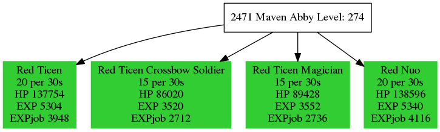

# 0w0
## What can it do?

These scripts can help you find proper farming field. Monster info will be highlighted in green if it has more than 3,000 base exp. ( you can change the thereshold in gmi2dot.sh )

Input: 

```bash

./getMapInfo.sh 2471 |./gmi2dot.sh |dot -Tpng -o "2471.png"

```

Then the script will fetch data from tosbase and produce a picture like below.



## Requirement:

FIY

## usage:

```bash

./getMapInfo.sh |./gmi2dot.sh |dot -Tpng | display -

```

multiple usage.


```bash

curl -sv "http://www.tosbase.com/database/maps/?name=&order=Level&type=Field&page=5" |&grep -o "game/world-map/[0-9]*/" |sed 's/[^0-9]//g'|xargs -n1 -P0 ./getMapInfo.sh 

```

